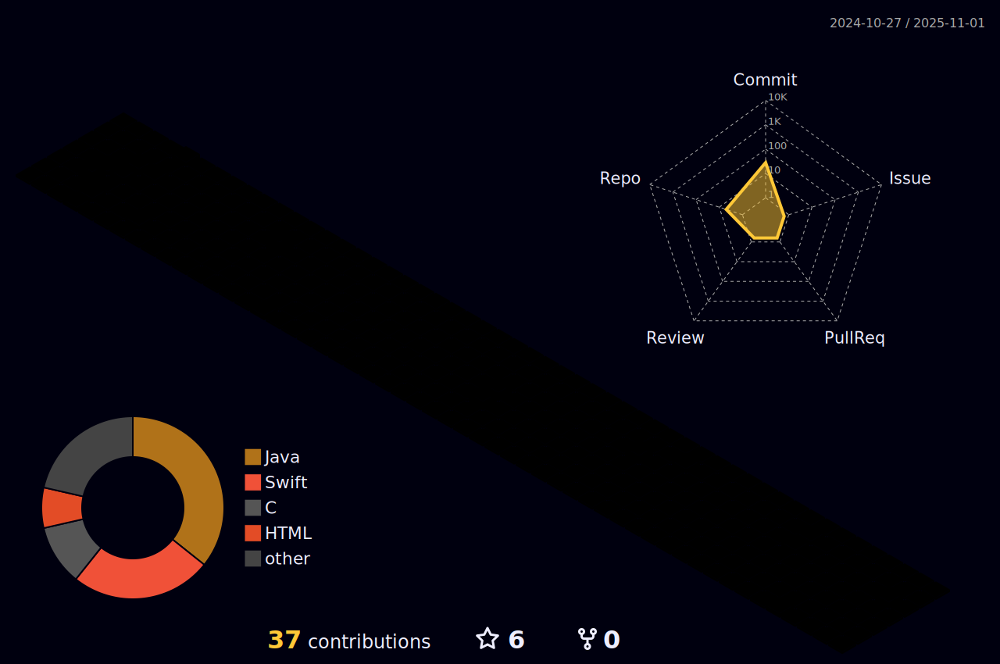

I am a Computer Science student and I am a great technology enthusiast. I like to venture into different areas, from hardware to software, seeking absolute knowledge. As a fullstack developer under construction I want to become completely versatile in any type of implementation.

##

##
## 🖥️Technologies

  
  
  
  
   
<!--    -->
  <!---->
  
<!--    -->
<!--    -->
  
  
  
<!--    -->
  
  
  
  

          

##

 ## 📲Contact

<!---->
<!---->

<!--<picture>
  <source
    media="(prefers-color-scheme: dark)"
    srcset="https://raw.githubusercontent.com/platane/snk/output/github-contribution-grid-snake-dark.svg"
  />
  <source
    media="(prefers-color-scheme: dark)"
    srcset="https://raw.githubusercontent.com/platane/snk/output/github-contribution-grid-snake.svg"
  />
  
</picture>-->

